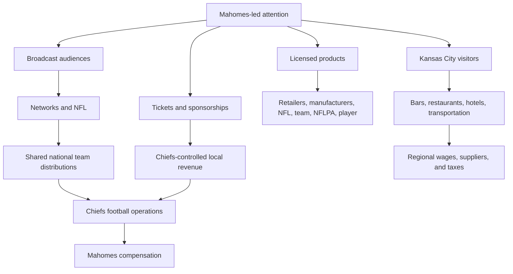
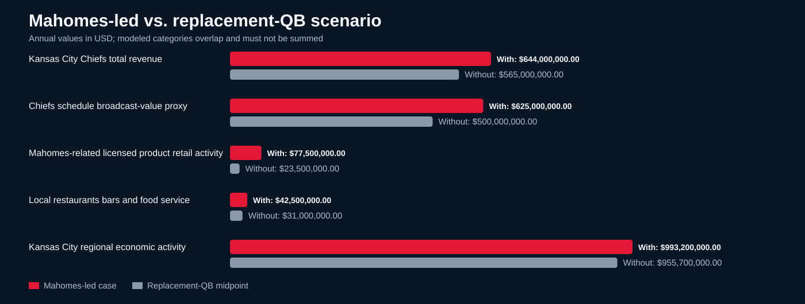

# The Mahomes Economic Engine

An open, reproducible model of the annual economic ecosystem surrounding a Patrick Mahomes-led Kansas City Chiefs season.

The repository answers two questions:

1. How much annual economic activity is connected to the Chiefs, NFL media, licensed products, and Kansas City hospitality?
2. What might change if Mahomes were replaced by an average starting quarterback?

## Headline result

Mahomes' reported 2026 compensation averages **$1.80 per second** across a calendar year. The broader, overlapping ecosystem includes:

| Area | Annual value | Annualized value per second |
|---|---:|---:|
| Chiefs total revenue | $644.0M | $20.42 |
| Chiefs schedule broadcast-value proxy | $625.0M | $19.82 |
| Mahomes-related licensed product sales | $75.0M-$80.0M | $2.38-$2.54 |
| Local restaurants, bars, and food service | $25.0M-$60.0M | $0.79-$1.90 |
| Kansas City regional economic activity | $993.2M | $31.49 |
| Missouri tax revenue | $28.8M | $0.91 |

These rows **must not be added together**. Media rights, team revenue, merchandise, local spending, and regional economic impact overlap.

## Money flow



## With Mahomes vs. replacement quarterback

The counterfactual preserves the Chiefs franchise, stadium, schedule, and NFL. It changes the starting quarterback and assumes reduced national demand, merchandise activity, playoff probability, and visitor spending.

| Area | Mahomes-led case | Replacement-QB case | Modeled annual loss |
|---|---:|---:|---:|
| Chiefs revenue | $644M | $550M-$580M | $64M-$94M |
| Chiefs schedule broadcast value | $625M | $469M-$531M | $94M-$156M |
| Player-linked licensed products | $75M-$80M | $15M-$32M | $43M-$65M |
| Local bars and restaurants | $25M-$60M | $17M-$45M | $8M-$15M |
| Regional economic activity | $993.2M | $943.2M-$968.2M | $25M-$50M |
| Missouri tax revenue | $28.8M | $27.4M-$28.1M | $0.7M-$1.4M |

At a placeholder replacement-quarterback cost of $10M, the Chiefs would save $46.8M in gross quarterback compensation. The modeled Chiefs revenue reduction is $64M-$94M, creating a negative gross difference of approximately $17.2M-$47.2M before considering franchise valuation or broader ecosystem effects. Salary-cap dollars may also be reallocated rather than retained as profit.



## Repository structure

```text
.
├── data/
│   ├── inputs.csv              # Reported, derived, and modeled inputs
│   └── sources.csv             # Source register
├── docs/
│   ├── methodology.md          # Formulas, assumptions, and limitations
│   └── communications.md       # Graphic and social copy
├── output/
│   ├── annualized_values.csv   # Generated annual-to-second conversion
│   ├── counterfactual.csv      # Generated comparison
│   └── comparison.svg          # Generated visual
├── scripts/
│   └── calculate.py            # Standard-library calculation pipeline
└── .github/workflows/
    └── validate.yml            # Rebuild and verify outputs on each push
```

## Reproduce the analysis

Python 3.10 or newer is sufficient; there are no third-party dependencies.

```bash
python scripts/calculate.py
```

The script validates ranges, recalculates all annualized rates, writes both output CSV files, and regenerates the SVG comparison.

## Interpretation rules

- **Reported** means a value is stated by a cited source.
- **Derived** means arithmetic is performed on reported values.
- **Modeled** means a transparent scenario assumption, not an audited result.
- "NIL" is used colloquially. For an NFL player, the more precise terms are individual publicity rights, group licensing, endorsements, and commercial use of name, image, and likeness.
- Network profit and the NFL/Chiefs split of player-specific licensing revenue are not publicly disclosed.

## Disclaimer

This is an independent educational model. It is not affiliated with Patrick Mahomes, the Kansas City Chiefs, the NFL, the NFLPA, or Kansas City. Brand names are used only to identify the subjects of the analysis.
